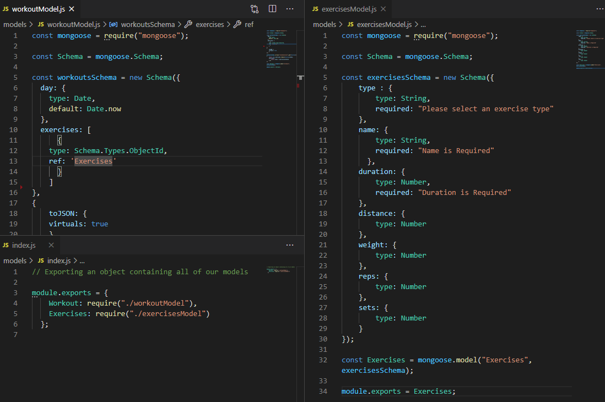
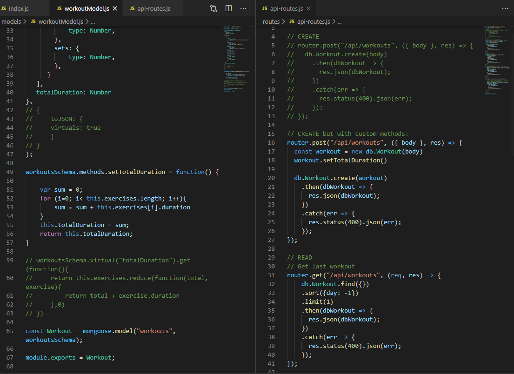

# Fitness Tracker

Jeffrey Adamo  
UW Full Stack BootCamp  
[Fitness Tracker Website](https://mysterious-lowlands-27364.herokuapp.com/)  
[Fitness Tracker GitHub Repo](https://github.com/jeffreyadamo/fitnessTracker)  
<br>
  
***

## Description

Unit 17 NoSQL: This project features a workout tracking application to view and track daily workouts. The goal of this project was to create a Mongo database with Mongoose schema utilizing route handling with Express. Front end code was provided from UW Coding Bootcampt (Trilogy). 

## User Story

* As a user, I want to be able to view create and track daily workouts. I want to be able to log multiple exercises in a workout on a given day. I should also be able to track the name, type, weight, sets, reps, and duration of exercise. If the exercise is a cardio exercise, I should be able to track my distance traveled.

  

## Table of Contents

* [Installation](#installation)

* [Usage](#usage)

* [Issues](#issues)

* [License](#license)

* [Contributing](#contributing)

* [Tests](#tests)

* [Questions](#questions)

## Installation

### For local hosting, clone from [GitHub repository](https://github.com/jeffreyadamo/fitnessTracker) and run the following commands to install dependencies and seed data using MongoDB:

* npm i
* mongod
* npm run seed 
* npm start


## Usage

This application is deployed on Heroku using the mLab add-on. 

Users visiting the [Fitness Tracker](https://mysterious-lowlands-27364.herokuapp.com/) website are visited with 3 HTML routes:  
* "/" - features a GET request to /api/workouts to display the most recent workout. User can select "Continue Workout" or "New Workout" and is directed to /exercise  
* "/exercise"  - user can fill out a form for their new or continuing exercise and will utilize PUT and POST requests
* "/stats"  - user is created with 2 charts of aggregated data from the GET request at api/workouts/range

 

In order for the application to run successfully, the following files were created: 
* server.js
* /models  
* * workoutModel.js
* * index.js
* /routes
* * html-routes.js
* * api-routes.js

## Issues

### Models

The mongoose schema used for this app is located in /models/workoutModel.js and is exported where /models/index.js can be referenced:  
* Below is what is found in the /master branch:
```javascript
const mongoose = require("mongoose");

const Schema = mongoose.Schema;

const workoutsSchema = new Schema(
  {
    day: {
      type: Date,
      default: Date.now,
    },
    exercises: [
      {
        type: {
          type: String,
          required: "Please select an exercise type",
        },
        name: {
          type: String,
          required: "Name is Required",
        },
        duration: {
          type: Number,
          required: "Duration is Required",
        },
        distance: {
          type: Number,
        },
        weight: {
          type: Number,
        },
        reps: {
          type: Number,
        },
        sets: {
          type: Number,
        },
      },
    ],
  },
  {
    toJSON: {
      virtuals: true,
    },
  }
);

workoutsSchema.virtual("totalDuration").get(function () {
  return this.exercises.reduce(function (total, exercise) {
    return total + exercise.duration;
  }, 0);
});

const Workout = mongoose.model("workouts", workoutsSchema);

module.exports = Workout;

```


I would like to be able to seperate the "exercises" property into its own /models/exercises.js schema and reference it in workoutSchema, but could not get this to work: 
 
* Below is what is found in the /models branch:  
  
<br>
* An empty array is returned with this model set  

### Custom Methods
The above workoutsSchema utilizes a "virtual" to create a function to set the "totalDuration" property of the model. We've discussed in class how to use a "method" instead to solve this, but I have not been able to render it effective. 
* Below is what is found in the /customMethod branch; commented out code is what works in /master branch:
  
<br>
* "totalDuration" will show up as "0"; cannot get my method to render this aggregated total.


## License


## Contributing

If you have remarks or suggestions, please open an issue @ [Fitness Tracker GitHub Repo](https://github.com/jeffreyadamo/fitnessTracker)  

## Tests

none

## Questions

For questions, open an issue or contact my GitHub  


    

@ [jeffreyadamo](http://www.github.com/jeffreyadamo)  
 