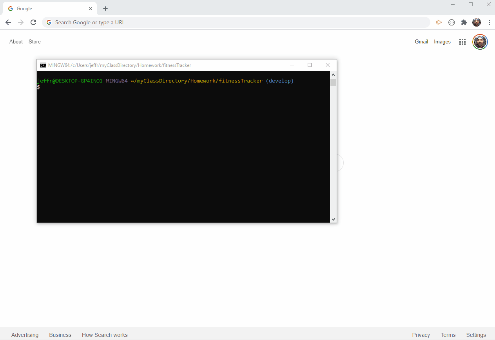

# Fitness Tracker

Jeffrey Adamo  
UW Full Stack BootCamp  
[Fitness Tracker Website](#)  
[Fitness Tracker GitHub Repo](https://github.com/jeffreyadamo/fitnessTracker)  
 
  
***

## Description

Unit 17 NoSQL: This project features a workout tracking application to view and track daily workouts. The goal of this project was to create a Mongo database with Mongoose schema utilizing route handling with Express. Front end code was provided from UW Coding Bootcampt (Trilogy). 

## User Story

* As a user, I want to be able to view create and track daily workouts. I want to be able to log multiple exercises in a workout on a given day. I should also be able to track the name, type, weight, sets, reps, and duration of exercise. If the exercise is a cardio exercise, I should be able to track my distance traveled.

  

## Table of Contents

* [Installation](#installation)

* [Usage](#usage)

* [License](#license)

* [Contributing](#contributing)

* [Tests](#tests)

* [Questions](#questions)

## Installation

### Please run the following command to install dependencies:

npm i

## Usage

Application is deployed GitHub repository and served on Heroku with JawsDB. 

Users visiting [Heroku link](#) are visited with 3 HTML paths @ "/", "/stats", and "/exercise". At "/", the user has options to POST and PUT data provided in fitness form. "/stats" brings up the user dashboard API routes for these are provided. "/exercise" provides a form for the user to create an workout or add an exercise to an continuing workout.  

In order for the application to run successfully, the following files were created: server.js, /models, and /routes. 

## License

## Contributing

GitHub Repo @

## Tests

### To run tests, run the following command:

none

## Questions

For questions, open an issue or contact my GitHub  

    

@ [jeffreyadamo](http://www.github.com/jeffreyadamo)  
GitHub email set as private. 

 